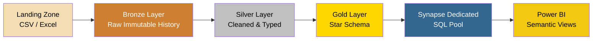
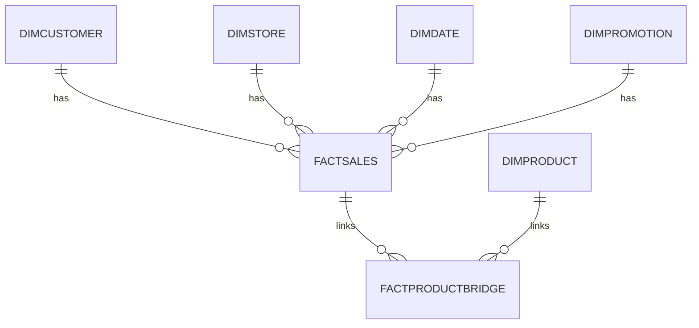

# 🏪 Retail Transactions Medallion Pipeline

**Enterprise-grade Lakehouse ETL & Analytics Platform** built on Azure Synapse Analytics, implementing the **Medallion Architecture** (Bronze → Silver → Gold) to transform raw daily retail transactions into a governed, star-schema-modeled data warehouse ready for BI consumption.

---

## 📖 Overview

This repository documents and implements the **Retail Transactions Medallion Data Pipeline**, engineered to ingest, cleanse, transform, and model high-volume daily retail transaction data into an optimized **dimensional Star Schema** for enterprise reporting and analytical exploration.

The pipeline strictly follows the **Medallion Architecture** paradigm, structuring data flow into three incremental quality layers — **Bronze**, **Silver**, and **Gold** — guaranteeing data lineage, auditability, and fully idempotent reprocessing.

> **Architectural Principle:** Ingestion bugs or business rule changes can be re-run at any time from the immutable Bronze layer, without ever needing to re-extract data from source operational systems.

---

## 🗂️ Table of Contents

- [Architecture Overview](#-architecture-overview)
- [Storage Hierarchy & Folder Structure](#-storage-hierarchy--folder-structure)
- [Synapse PySpark Transformation Engine](#-synapse-pyspark-transformation-engine)
- [Gold Layer: Star Schema Modeling](#-gold-layer-star-schema-dimensional-modeling)
- [Synapse Dedicated SQL Pool](#-synapse-dedicated-sql-pool-data-warehouse)
- [Data Quality & Governance Framework](#-automated-data-quality--governance-framework)
- [BI Analytics Catalog & Power BI Views](#-bi-analytics-catalog--power-bi-views)
- [Tech Stack](#-tech-stack)
- [License](#-license)

---

## 🏗️ Architecture Overview

| Layer | Purpose |
|---|---|
| 🟤 **Bronze** | Raw, immutable data ingested from daily operational batch files (CSV/Excel), enriched with audit and lineage metadata. |
| ⚪ **Silver** | Cleaned, standardized, typed, and deduplicated datasets — string cleansing, null normalization, date decomposition, and array conversion for multi-item baskets. |
| 🟡 **Gold** | Enterprise Star Schema with conformed dimensions (Customer, Product, Store, Date, Promotion) and centralized fact tables (Sales Fact + Product Bridge), persisted as partitioned CSVs and loaded into Synapse Dedicated SQL Pool. |

---

## 📁 Storage Hierarchy & Folder Structure

The data lake is hosted on **Azure Data Lake Storage (ADLS) Gen2**, using hierarchical namespaces for optimized partition scanning and granular security.

| ADLS Gen2 Path | Layer / Zone | Description & Quality Standard |
|---|---|---|
| `/landing/<batch_date>/` | Operational Landing Zone | Raw incoming daily transaction batch files (CSV/Excel), staged temporarily before ingestion. |
| `/bronze/transactions/batch_date=<date>/` | Bronze (Raw History) | Exact copy of source data as CSV, with ingestion timestamps and batch date partition tags. |
| `/silver/transactions/` | Silver (Cleaned & Typed) | Validated, typed, standardized transaction records — duplicates and malformed rows removed. |
| `/gold/Dim<DimensionName>/` | Gold (Dimensions) | Surrogate-keyed conformed dimension tables. |
| `/gold/FactSales/` | Gold (Sales Fact) | Core transactional fact table with dimension foreign keys and quantitative measures. |
| `/gold/FactProductBridge/` | Gold (Bridge Table) | Resolves the many-to-many relationship between transactions and individual products. |

---

## ⚙️ Synapse PySpark Transformation Engine

ETL processing is implemented in **PySpark** on Azure Synapse Apache Spark pools, executing a structured pipeline from raw ingestion to dimensional aggregation.

### Ingestion & Multi-Format Readers
- All columns are initially read as `StringType` to isolate formatting discrepancies and prevent schema drift.
- A unified dispatcher function, `read_any()`, dynamically routes files by extension (`.csv` / `.xlsx`), using `pandas` to ingest Excel workbooks before converting them to distributed Spark DataFrames.

### Bronze Layer Transformation
- **Zero-loss ingestion** — no business filtering or type casting applied.
- Enriched with two audit columns:
  - `ingestion_timestamp` — via `F.current_timestamp()`
  - `source_batch_date` — via `F.lit(batch_date)` for partition pruning.

### Silver Layer: Cleansing & Feature Engineering
- **String Sanitization** — `F.trim()` across all string columns; `F.initcap()` for Title Case on categorical attributes (Customer_Name, City, Store_Type, Season, Promotion, Payment_Method).
- **Null Normalization** — placeholder tokens (`''`, `'NA'`, `'N/A'`, `'NULL'`, `'None'`, `'-'`) converted to true SQL `NULL`.
- **Strict Type Casting** — dates parsed to `TimestampType`; `Total_Items` → `IntegerType`; `Total_Cost` → `DoubleType`; `Discount_Applied` → `BooleanType`.
- **Date Feature Engineering** — `Year`, `Month`, `Day`, `Quarter`, `Month_Name` extracted from the transaction timestamp.
- **Market Basket Array Conversion** — delimited product strings (e.g. `"Milk, Bread, Eggs"`) converted to `ArrayType(StringType())` via `F.split()` and `F.transform()`.

### Silver Data Validation & Deduplication
Records must pass all mandatory checks before promotion:

| Rule | Condition |
|---|---|
| Mandatory Keys | `Transaction_ID` and `Date` must not be null |
| Measure Integrity | `Total_Items > 0` and `Total_Cost >= 0.0` |
| Basket Validation | `Product_Array` must contain ≥ 1 item |
| Deduplication | Exact duplicates on `Transaction_ID` removed via `dropDuplicates()` |

---

## ⭐ Gold Layer: Star Schema Dimensional Modeling

Surrogate keys are generated using PySpark Window functions (`F.row_number().over(Window.orderBy(...))`) to ensure stable, contiguous keys without relying on distributed hash collisions.

| Gold Table | Primary / Foreign Keys | Attributes & Measures | Grain |
|---|---|---|---|
| **DimCustomer** | `Customer_Key` (PK) | Customer_Name, Customer_Category | Distinct customer profiles |
| **DimProduct** | `Product_Key` (PK) | Product_Name | Individual product items exploded from Silver array |
| **DimDate** | `Date_Key` (PK) | Full_Date, Day, Month, Month_Name, Quarter, Year, Season | Calendar dimension |
| **DimStore** | `Store_Key` (PK) | City, Store_Type | Physical/operational store categorization |
| **DimPromotion** | `Promotion_Key` (PK) | Promotion, Discount_Applied | Marketing campaigns & discount flags |
| **FactSales** | `Transaction_ID` (PK) | Date_Key, Customer_Key, Store_Key, Promotion_Key, Total_Items, Total_Cost | Core transactional grain |
| **FactProductBridge** | `Transaction_ID`, `Product_Key` (FKs) | Composite associative bridge | Resolves many-to-many transaction/product mapping |

> **Design Justification — Why a Bridge Table?**
> A single transaction contains multiple products, and a single product spans multiple transactions (many-to-many). Embedding product keys directly in `FactSales` would cause row duplication and false revenue multiplication. `FactProductBridge` cleanly separates item-level basket associations from transaction-level financial totals.

---

## 🏢 Synapse Dedicated SQL Pool (Data Warehouse)

Gold-layer CSVs in ADLS Gen2 are loaded into **Azure Synapse Dedicated SQL Pool** via PolyBase / External Tables, using dedicated schemas: `stg` (external landing) and `dw` (high-performance columnar tables).

### Table Distribution & Indexing Strategy
- **Replicated Dimensions** — all dimension tables use `DISTRIBUTION = REPLICATE`, broadcasting small (< 2GB) tables to every compute node and eliminating data movement during star joins.
- **Hash-Distributed Facts** — `FactSales` and `FactProductBridge` use `DISTRIBUTION = HASH(Transaction_ID)`, ensuring co-located joins without network shuffling.
- **Columnstore Indexing** — all warehouse tables use `CLUSTERED COLUMNSTORE INDEX (CCI)` for up to 5x compression and high-performance aggregation.

### T-SQL ETL Loading & Cleansing Logic
- **Date Key Remapping** — timestamps converted into integer `YYYYMMDD` keys via `CAST(FORMAT(...))`.
- **Product Character Cleaning** — residual array punctuation stripped from `dw.DimProduct` via nested `REPLACE()`/`TRIM()`.
- **Boolean Translation** — text booleans in `ext_DimPromotion` mapped to SQL bit flags, defaulting nulls to `'No Promotion'`.
- **Foreign Key Harmonization** — `FactSales` joins to `stg.ext_DimDate` at load time, and missing promotion keys default to `-1` (orphan handler).

---

## 🛡️ Automated Data Quality & Governance Framework

A **10-point SQL data quality test suite** is embedded in the warehouse workflow to guarantee analytical trust:

| # | Test Suite | Target Table(s) | Quality Rule |
|---|---|---|---|
| 1 | Null Attribute Audit | FactSales / DimProduct | Scans core measures & product names for unexpected NULLs |
| 2 | Foreign Key Null % | FactSales | Calculates % of missing dimensional keys |
| 3 | Duplicate Key Check | DimProduct | Detects PK collisions via `GROUP BY ... HAVING COUNT(*) > 1` |
| 4 | Referential Integrity | FactSales vs DimCustomer | LEFT JOIN detects orphaned fact records |
| 5 | Date Bounds Validation | FactSales vs DimDate | Ensures every date key maps to a valid calendar record |
| 6 | Revenue Outlier Detection | FactSales | Z-Score approximation (`Cost > Avg + 3*StdDev`) flags anomalies |
| 7 | Bridge Distribution | FactProductBridge | Verifies realistic market basket sizes |
| 8 | Customer Categorization | DimCustomer | Validates segment distribution across demographics |
| 9 | Store Alignment | DimStore | Audits store counts by City/Type for mislabeling |
| 10 | Promo Usage Tracking | DimPromotion | Cross-validates promotion names against discount flags |

---

## 📊 BI Analytics Catalog & Power BI Views

The warehouse exposes structured semantic layers for **Power BI** reporting and ad-hoc EDA: **25 advanced T-SQL queries** + **6 optimized reporting views**.

### 🔎 EDA Query Catalog (25 Queries)

| Category | Queries | Focus |
|---|---|---|
| Core Macro Metrics | Q1–Q4 | Total Revenue, Transactions, AOV, Avg Basket Size |
| Time & Seasonality | Q5–Q8 | Revenue by Year, Quarter, Month, Season |
| Customer Segmentation & LTV | Q9–Q11, Q25 | Revenue by category, Top 10 customers, segment contribution |
| Store Performance | Q12–Q15 | Revenue by City/Store Type, Top 5 cities |
| Promotion Effectiveness | Q16–Q18 | Revenue per campaign, basket size during promos, discount impact |
| Product & Basket Analytics | Q19–Q23 | Top/bottom products, demographic cross-tabs, seasonal demand |
| Growth Trends | Q24 | MoM revenue growth via `LAG()` / `OVER()` window functions |

### 🖥️ Power BI Semantic Views (`dw` schema)

| View | Underlying Tables | Application |
|---|---|---|
| `vw_SalesOverview` | FactSales, DimDate, DimCustomer, DimStore | Denormalized master feed for executive dashboards |
| `vw_CustomerAnalysis` | DimCustomer, FactSales | Customer LTV, transaction count, AOV per segment |
| `vw_ProductPerformance` | DimProduct, FactProductBridge, FactSales | Units sold & unique customer acquisition per product |
| `vw_PromotionAnalysis` | DimPromotion, FactSales | Marketing KPI: adoption & revenue per campaign |
| `vw_StorePerformance` | DimStore, FactSales | Revenue, volume, basket size by city/store type |
| `vw_TimeAnalysis` | DimDate, FactSales | Daily/monthly/quarterly/seasonal revenue velocity |

> **BI Best Practice — Semantic Abstraction:** Power BI imports/DirectQuery connections point exclusively to `dw.vw_*` views rather than base tables, letting the data engineering team change indexing, partitioning, or distribution strategies without breaking downstream reports.

---

## 🧰 Tech Stack

| Category | Technology |
|---|---|
| **Storage** | Azure Data Lake Storage (ADLS) Gen2 |
| **Processing Engine** | Azure Synapse Analytics — Apache Spark Pools (PySpark) |
| **Data Warehouse** | Azure Synapse Dedicated SQL Pool (MPP, Columnstore) |
| **Reporting** | Power BI |
| **Languages** | Python (PySpark), T-SQL |

---

## 📄 License

This project is licensed under the MIT License — feel free to use, modify, and distribute with attribution.

---

Built with ❤️ using Azure Synapse Analytics

